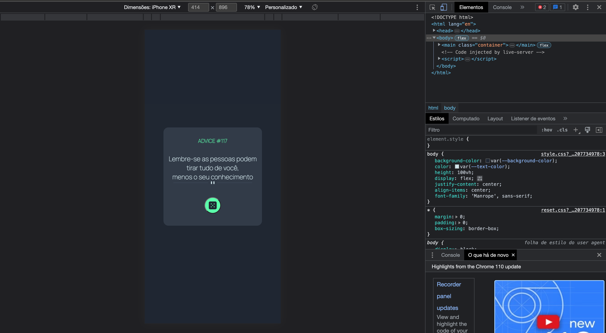
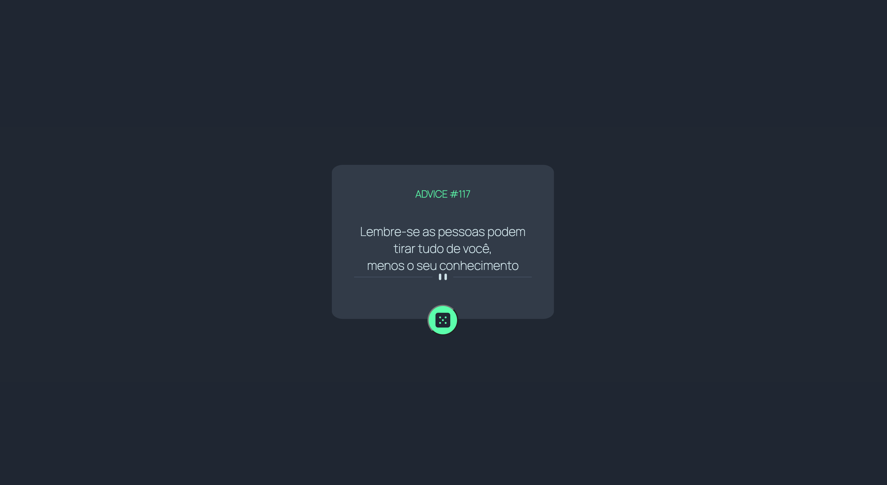

# Descrição Do Projeto APP GERADOR DE CONSELHOS- DevEmDobro 

Esse exercício é uma ALTERNATIVA ao desafio  Frontend Mentor | Advice generator app coding challenge. Onde o principal desafio é construir um aplicativo que gere conselhos aleatórios. Nessa primeira etapa do exercício, será realizado apenas a construção do HTML e CSS.

## Prints  
### Disign Mobile

### Disign Desktop 

# Feramenta Utilizada: 
- CSS3
- HTML5